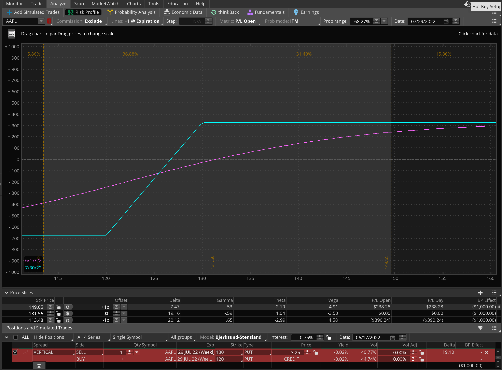

The market has bee dropping brutally over the last couple of weeks. It looks like it has come to a support level.

Below is a chart of Apple (AAPL), which is a proxie for the broader market. It looks like the market could go up or go sideways.

To take advantage of this situation I will sell a 29 July PUT Vertical.

SELL -1 VERTICAL AAPL 100 (Weeklys) 29 JUL 22 130/120 PUT @3.25 LMT

