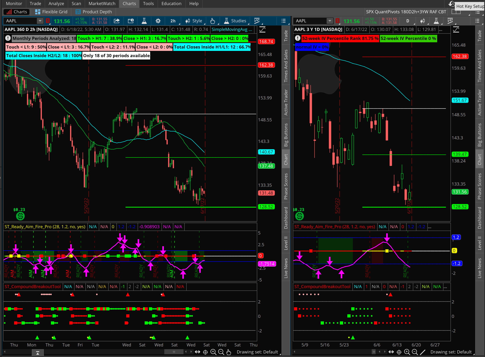

Hello World! 

I have finally worked out how to create and publish this blog on Netlify.

This blog is about my options trading experiment, where I will be trading with a small $500 options. The emphasis is on learning: 
- Learning to manage risk
- learning from observation

This is a chart of where Apple (AAPL) ended up at the close today:

This is an Risk Profile of an AAPL Calendar trade that I'm evaluating. I use these charts to analyse my trades before I open the trade. Sometimes I use these charts as paper trades to see how the trade would go. I find this a really good way to learn without risking money (hard earned Capital).

